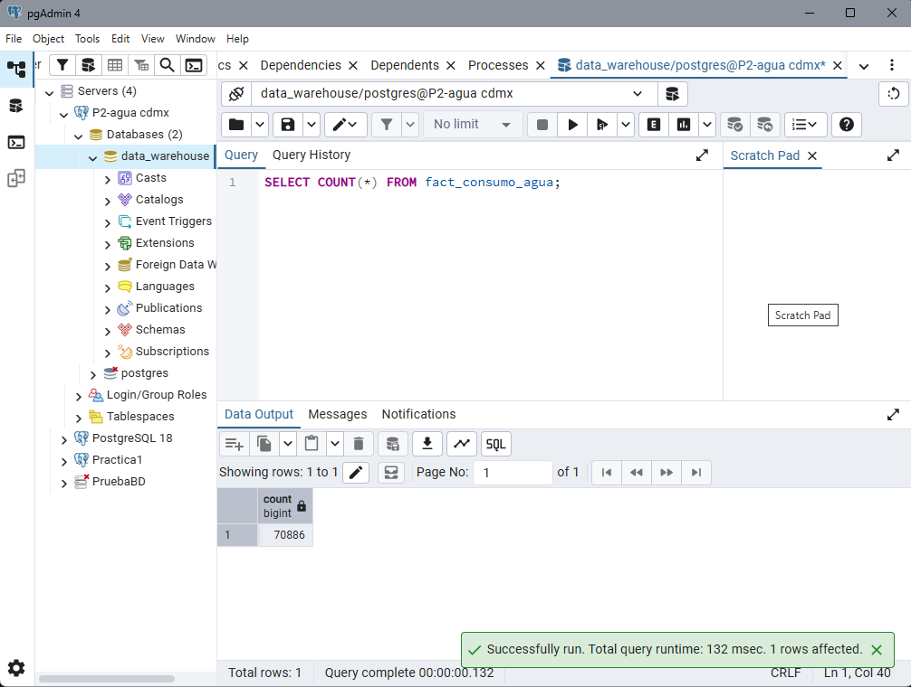
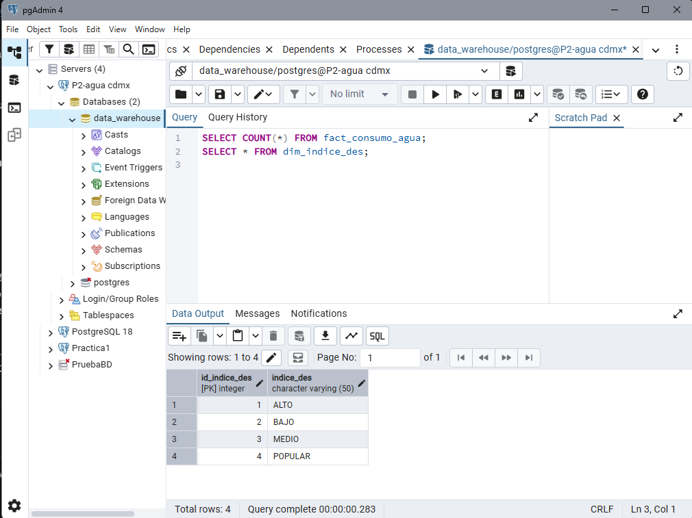
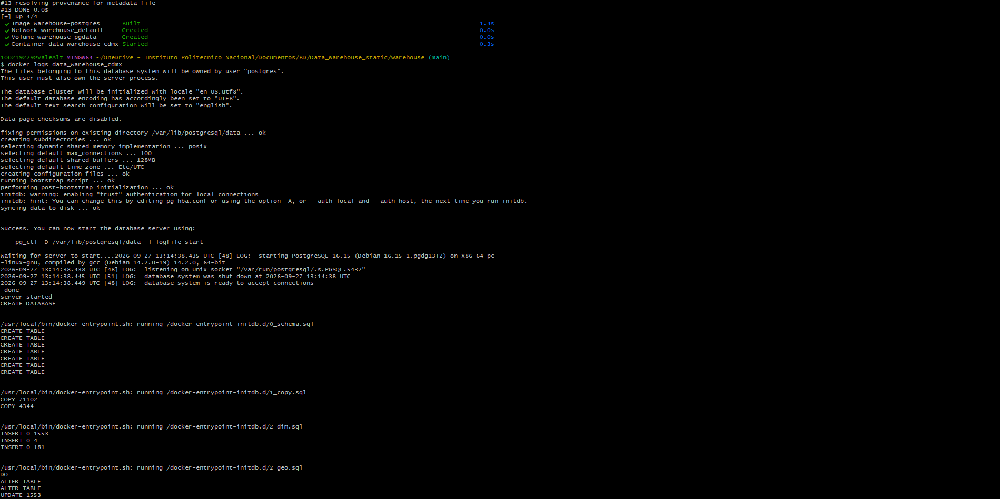
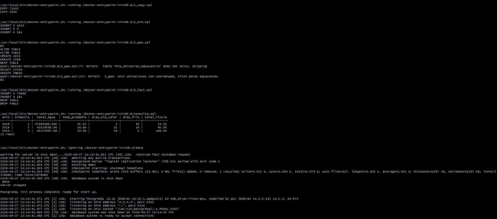
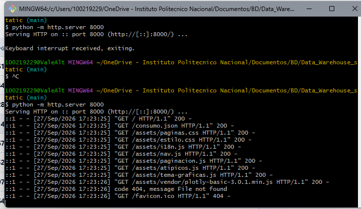
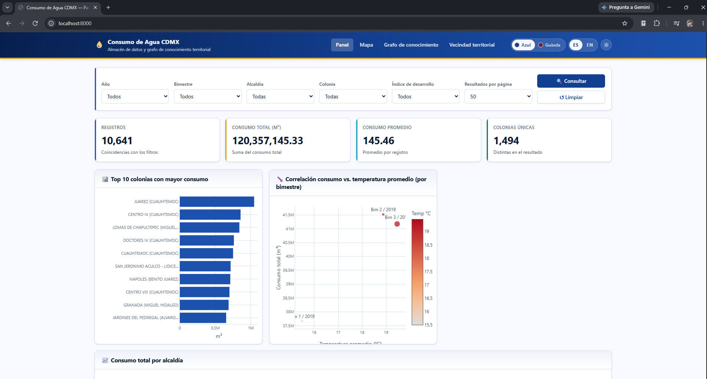

# Levantamiento del proyecto asignado: Consumo de agua en la CDMX

## 1. Datos del proyecto
- Repositorio original: https://github.com/gabrielhuav/Data_Warehouse_static
- Mi fork: https://github.com/ValeAR1/Data_Warehouse_static
- Commit con el que se puso en funcionamiento: b9366f0014b5bfc401b927f318daaab6f4bc2163
- Nota: el sistema corrió con una modificación local del puerto (5433 → 5434) en el archivo de Docker de `warehouse/`, que no se subió con commit.

## 2. Requisitos

Para poder levantar este proyecto se debe tener ya instalado diferentes programas como:
- Contarcon una cuenta en GitHub: el proyecto se encuentra en un repositorio de GitHub por ende para hacerlo funcionar en una unidad de computo se debe tener este repositorio en la computadora. 
- Git: Este programa ayudará a la comunicación entre la computadora y el repositorio.
- Git bash: Es la terminal por defecto de git, esta ayuda a poder usar los comandos para añadir o bajar el repositorio a la computadora.
- Docker: Es un software que ayuda a levantar el contenedor del proyecto y aísla el software del resto de la computadora. Aun así, comparte los puertos con la computadora, lo que puede causar conflictos. El contenedor asegura que pueda ser reproducible en cualquier equipo de computo.
- Python: Lenguaje de programación que fue usado con la única intención de levantar el servidor y poder visualizar la interfaz en el navegador. 
- Navegador web: sitio donde se va a ver la interfaz del proyecto. 
- PostgreSQL: No es necesario instalarlo aparte, en este proyecto viene dentro del contenedor docker. 
- PgAdmin: Interfaz gráfica de PostgreSQL, aquí se conectan las bases de datos y se puede hacer consultas sql directamente en la base de datos. 

## 3. Pasos ejecutados
Para empezar el levantamiento de este proyecto se tuvo que crear un fork del repositorio https://github.com/gabrielhuav/Data_Warehouse_static.git en la cuenta personal de GitHub para eventualmente clonarlo en el equipo de cómputo y poder empezar a trabajar en él desde la terminal.
Desde la terminal se ingresó a la carpeta del fork clonado y se trabajó en el main.

Para empezar con el levantamiento del almacén con Docker primero se abrió la aplicación Docker Desktop, después en la terminal se levantó con el comando `docker compose up -d --build`, pero a la hora de este primer intento en la terminal se mostró el correcto levantamiento del build pero al querer arrancar falló. Lo que sucedió fue que el puerto que se mandó a ocupar ya estaba siendo utilizado por un contenedor creado para la práctica 1, se solucionó por medio del comando `docker stop pg-practica1`, este apagó el contenedor pero sin borrar su información. Se intentó nuevamente y en este segundo intento hubo un inconveniente nuevamente con los puertos ya que el contenedor sí corría por dentro pero no se conectó a ningún puerto de la computadora evitando conexión con el lado externo. Esto se arregló dando de baja todo el contenedor con `docker compose down`, se verificó que el puerto 5433 siguiera libre con `docker ps` y se volvió a levantar el contenedor con `docker compose up -d --build`, así finalmente se levantó el contenedor con su puerto ya establecido.

Una vez levantado el contenedor se ingresó el comando `docker logs data_warehouse_cdmx` el cual muestra el resumen de registros cargados que se muestran en el README, pero en lugar de eso la terminal mostró que Postgres se dio cuenta de que ya había datos guardados de un intento anterior y se saltó todo el proceso de ETL. Así que se tuvo que borrar nuevamente todo el contenedor junto con sus volúmenes con el comando `docker compose down -v` y nuevamente por tercera vez se levantó el contenedor con `docker compose up -d --build` e inmediatamente se ingresó `docker logs data_warehouse_cdmx` dando como resultado:
- Esquema completo: 7 tablas
- Carga de datos crudos
- Llenado de dimensiones
- Armado de las tablas de hechos
- Consulta de ejemplo

Ahora para abrir la interfaz no es solo darle doble clic porque el navegador bloquea que carguen los archivos JSON, así que se necesita crear un servidor local. Para hacer este paso se requería de Python, por ende se descargó. Al intentar levantar el servidor por primera vez, la terminal mostró un mensaje diciendo que no se encontraba Python y sugiriendo instalarlo desde la Microsoft Store, aunque ya estaba instalado. Esto pasó porque Windows tiene un alias que redirige el comando `python` a la tienda en lugar de usar la instalación real. Se resolvió desactivando los alias `python.exe` y `python3.exe` en Configuración > Aplicaciones > Configuración avanzada de aplicaciones > Alias de ejecución de aplicaciones, y después se cerró Git Bash y se abrió una ventana nueva, donde hubo que volver a ubicarse en la carpeta del fork. Una vez resuelto esto, se escribió desde la raíz el comando `python -m http.server 8000` y se abrió 'localhost:8000' en el navegador, permitiendo visualizar e interactuar con la interfaz.

Después se buscó el nombre de la base de datos para poder conectarla con PgAdmin, se utilizó el comando `docker exec -it data_warehouse_cdmx psql -U postgres -l` que mostró una lista y de ahí se obtuvo que el nombre de la base de datos es data_warehouse.

Con el nombre listo, ahora sí se ingresó a PgAdmin y se conectó la base de datos con los siguientes datos:
- Host: localhost
- Puerto: 5433
- Usuario: postgres
- Contraseña: postgres
- Base de datos: data_warehouse

Pero a la hora de conectarla salía un error con la contraseña y no dejaba conectarla. Así que por medio del comando `docker exec data_warehouse_cdmx env | grep POSTGRES` se obtuvo la contraseña y el usuario del contenedor, confirmando que:
- Usuario: postgres
- Contraseña: postgres

Son correctas, así que el problema fue ocasionado porque a la hora de instalarse PostgreSQL en el equipo de cómputo el puerto que utiliza es el 5433 y el contenedor también, así que lo que responde en ese puerto es el Postgres del equipo de cómputo y ocupa la contraseña de instalación. Una vez identificado este problema lo que se realizó fue un cambio de puertos en el documento *compose.yml* cambiando del puerto 5433 al 5434 y se recreó el contenedor con `docker compose down` y `docker compose up -d` sin borrar los volúmenes.
Ya con eso arreglado se volvió a intentar la conexión de la base de datos con los datos ya mencionados anteriormente, usando ahora el puerto 5434, y listo, se conectó la base de datos.

Una vez ya conectada la base se abrió el Query Tool sobre data_warehouse y se hizo una consulta, en este caso se ingresó `SELECT COUNT(*) FROM fact_consumo_agua;` así se obtiene en Data Output el número *70886* el cual es el número de filas de una sola tabla, en este caso de **fact_consumo_agua** la cual es una tabla de hechos. Por último se hizo una consulta más `SELECT * FROM dim_indice_des;` la cual muestra los 4 niveles de desarrollo que existen en la dimensión.

Para finalizar se tuvo que obtener el identificador del commit, este se obtiene con el comando `git log -1 --format=%H` el cual dio `b9366f0014b5bfc401b927f318daaab6f4bc2163` y para comprobar que sí se modificó el compose se utilizó `git status` el cual muestra en la terminal que el compose fue modificado.

## 4. Errores y cómo se resolvieron
A lo largo del levantamiento se presentaron varios problemas, en esta parte se especifican cuáles fueron y cómo fueron solucionados:

**Error 1: puerto 5433 ocupado**
- **Error:** al ejecutar `docker compose up -d --build` el build terminó bien, pero el contenedor no arrancó: `Bind for 0.0.0.0:5433 failed: port is already allocated`.
- **Causa:** el puerto 5433 ya estaba siendo utilizado por el contenedor creado para la práctica 1 (`pg-practica1`).
- **Solución:** se apagó ese contenedor con `docker stop pg-practica1`, sin borrar su información.

**Error 2: contenedor corriendo sin puerto expuesto**
- **Error:** el contenedor corría por dentro, pero no estaba conectado a ningún puerto de la computadora, lo que impedía la conexión desde el exterior.
- **Causa probable:** quedó a medias después del primer intento fallido.
- **Solución:** se dio de baja el contenedor con `docker compose down`, se verificó con `docker ps` que el puerto 5433 siguiera libre y se volvió a levantar con `docker compose up -d --build`.

**Error 3: Salto de proceso ETL**
- **Error:** al revisar `docker logs data_warehouse_cdmx`, Postgres se saltó todo el proceso de ETL y no cargó los datos.
- **Causa:** ya había datos guardados de un intento anterior (volumen), por lo que Postgres no volvió a inicializar la base.
- **Solución:** se borró el contenedor junto con sus volúmenes con `docker compose down -v` y se levantó de nuevo con `docker compose up -d --build`. Los logs ya mostraron el proceso completo.

**Error 4: Python no encontrado**
- **Error:** al levantar el servidor por primera vez, la terminal indicó que no se encontraba Python y sugirió instalarlo desde la Microsoft Store, aunque ya estaba instalado.
- **Causa:** Windows tiene un alias que redirige el comando `python` a la tienda en lugar de usar la instalación real.
- **Solución:** se desactivaron los alias `python.exe` y `python3.exe` en Configuración > Aplicaciones > Configuración avanzada de aplicaciones > Alias de ejecución de aplicaciones, se cerró Git Bash y se abrió una ventana nueva.

**Error 5: falla de autenticación en PgAdmin**
- **Error:** al conectar la base de datos, PgAdmin mostró `la autentificación password falló para el usuario postgres`.
- **Causa:** el Postgres instalado en el equipo de cómputo también utiliza el puerto 5433, por lo que respondía ese y pedía la contraseña de instalación, no la del contenedor.
- **Solución:** se cambió el puerto de 5433 a 5434 en el archivo *compose.yml*, se recreó el contenedor con `docker compose down` y `docker compose up -d` (sin borrar los volúmenes) y en PgAdmin se usó el puerto 5434. La conexión funcionó.

## 5. Consultas ejecutadas

Las consultas se ejecutaron en el Query Tool de PgAdmin, conectado a la base de datos `data_warehouse` con los siguientes datos:
- Host: localhost
- Puerto: 5434
- Usuario: postgres
- Base de datos: data_warehouse

**Consulta 1: número de registros de la tabla de hechos**
```sql
SELECT COUNT(*) FROM fact_consumo_agua;
```
Resultado: **70886**, que es el número de filas de `fact_consumo_agua`, la tabla de hechos del consumo de agua.



**Consulta 2: niveles de desarrollo**
```sql
SELECT * FROM dim_indice_des;
```
Resultado: muestra los 4 niveles de desarrollo que existen en la dimensión.



## 6. Evidencias 










